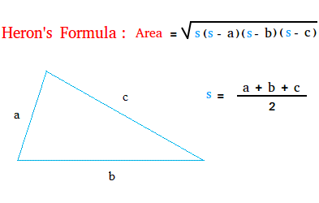
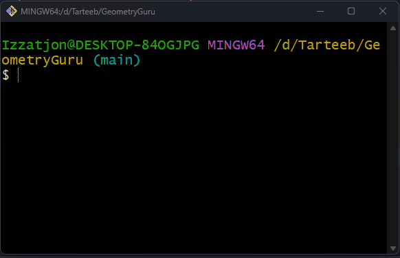

# 🧮 GeometryGuru

## Bu dastur C# tilida yozilgan oddiy konsol ilovasi bo‘lib, uchburchak yuzasini hisoblaydi.

## 🚀 Imkoniyatlari

Dastur quyidagi amallarni bajaradi:

- Foydalanuvchidan 3 ta tomon qabul qiladi (a, b, c)
- Uchburchak yuzasini Geron formulasi orqali hisoblaydi
- Natijani ekranga chiqaradi

---

## 🧠 Formula

`p = (a + b + c) / 2`
`S = √(p(p - a)(p - b)(p - c))`

---

## ▶️ Dastur ishlashi

---

## 📚 Qanday ishlaydi

1. Foydalanuvchi a, b, c tomonlarni kiritadi
2. Dastur yarim perimetrni hisoblaydi
3. Yuzani hisoblab chiqaradi

---

## 👨‍💻 Muallif

**Qodirov Izzatjon**

- GitHub: [rambo-mb](https://github.com/rambo-mb)
