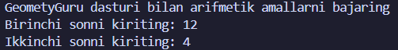
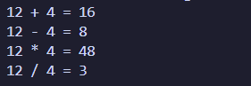

# 🧮 GeometryGuru

Oddiy va tushunarli arifmetik amallar kalkulyatori

---

## 🚀 Imkoniyatlari

Dastur quyidagi amallarni bajaradi:

- ➕ Qo‘shish
- ➖ Ayirish
- ✖️ Ko‘paytirish
- ➗ Bo‘lish

---

## 📚 Qanday ishlaydi

1. Foydalanuvchi ikkita son kiritadi
2. Dastur ushbu sonlar ustida barcha arifmetik amallarni bajaradi
3. Natijalar ekranga chiqariladi

---

## 🖼 Screenshots

### 🔢 Input qismi

### 📊 Natijalar

---

## 🎯 Maqsad

Ushbu loyiha dasturlashni o‘rganayotganlar uchun oddiy arifmetik amallarni tushunish va amaliyot qilish maqsadida yaratilgan.

---

## 👨‍💻 Muallif

**Qodirov Izzatjon**

- GitHub: [rambo-mb](https://github.com/rambo-mb)
