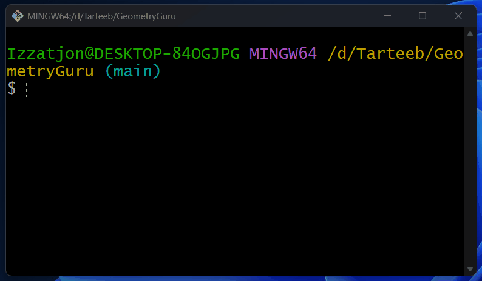

# 📐 GeometryGuru v2

## Bu dastur C# tilida yozilgan konsol ilovasi bo‘lib, arifmetik va geometrik hisob-kitoblarni bajaradi.

## 🚀 Imkoniyatlari

### 🔢 Arifmetik amallar:

- Qo‘shish (+)
- Ayirish (-)
- Ko‘paytirish (\*)
- Bo‘lish (/)
- Kvadrat (x²)
- Kub (x³)
- Kvadrat ildiz (√x)
- Darajaga oshirish (xʸ)
- Qoldiq (%) hisoblash

---

### 📐 Geometrik amallar:

- Uchburchak yuzasi (Heron formulasi)
- Aylana uzunligi va yuzasi
- Shar hajmi
- Silindr hajmi
- Konus hajmi
- Pifagor teoremasi

---

## ▶️ Dastur ishlashi

---

## 🛠️ Qanday ishlaydi

1. Foydalanuvchi menyudan bo‘lim tanlaydi
2. Kerakli amalni tanlaydi
3. Kerakli qiymatlarni kiritadi
4. Natija ekranga chiqariladi

---

## 👨‍💻 Muallif

**Qodirov Izzatjon**

- GitHub: [rambo-mb](https://github.com/rambo-mb)
